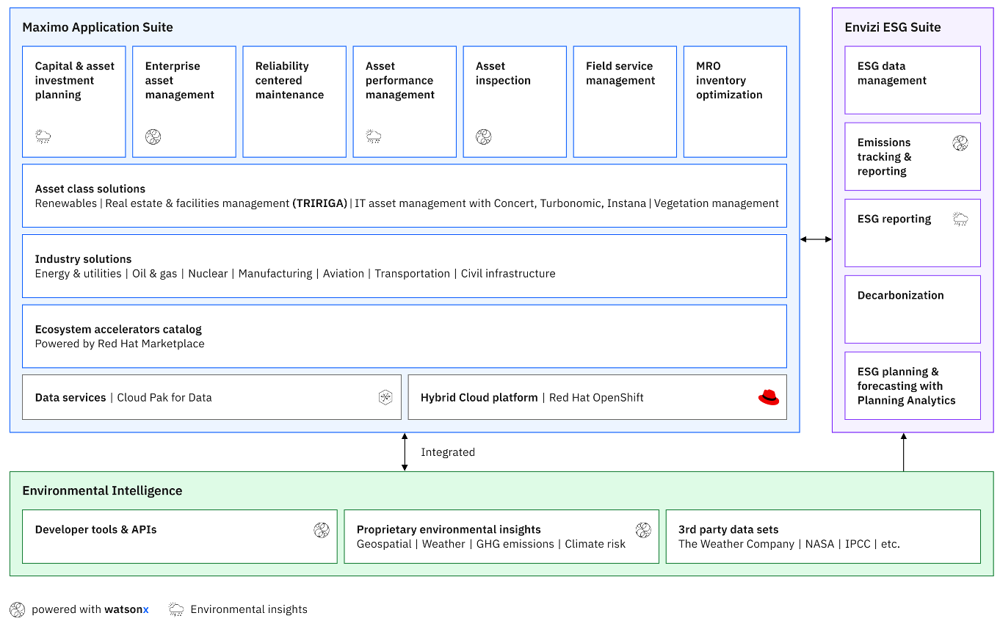
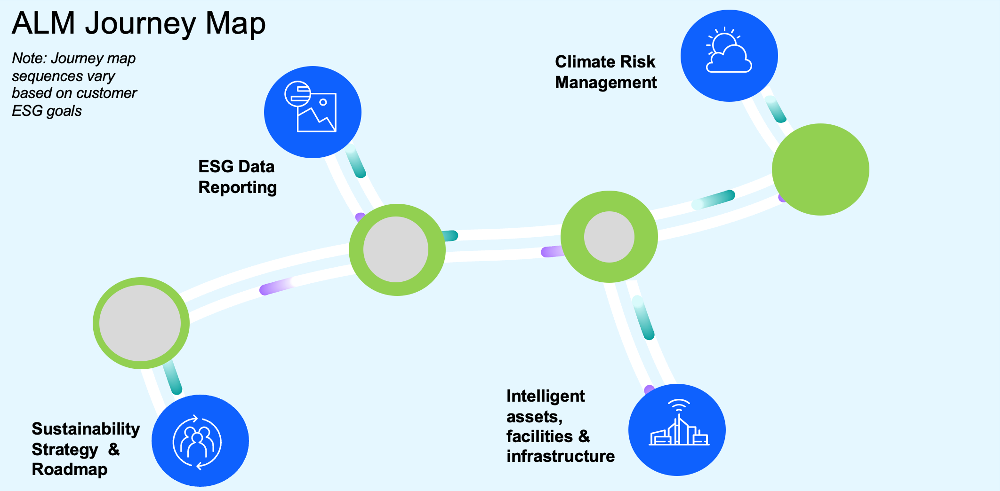

# Overview

<strong>Asset Life Cycle Management</strong> An asset is defined as something useful or valuable to an organization. The term includes physical and non-physical assets such as infrastructure, equipment, capital, and people. The asset lifecycle refers to the end-to-end process by which an asset is purchased, stored, used, and maintained throughout its useful life by its owner.

Organizations track the health of their assets by using several methods. Many use data from sensors connected to the <a href="https://www.ibm.com/topics/internet-of-things">Internet of Things (IoT)</a> to monitor asset health real-time performance and perform <a href="https://www.ibm.com/topics/what-is-preventive-maintenance">preventive maintenance</a> when necessary.

As part of an overall maintenance strategy, asset maintenance is performed regularly to reduce maintenance costs, extend asset life, and avoid unplanned downtime.

<strong>IBM Asset Lifecycle Management – Integrated Solution</strong>

<strong>Asset Lifecycle Management Reference Architecture</strong> The Asset Life Cycle Management reference architecture diagram demonstrates how integrated software applications across business functions can support organizations in achieving their Sustainability objectives. It provides a holistic view of data sources capturing critical sustainability metrics and shows how they are collected, assembled, analyzed, and reported to facilitate comprehensive corporate sustainability reporting. This process is essential for aligning organizational operations with sustainability goals.

The diagram also emphasizes the role of these data sources in actively operationalizing sustainability initiatives, from tracking to reporting to executing corrective actions through AI-powered applications. Organizations can minimize environmental impacts, enhance asset performance, and uphold regulatory compliance by managing the entire asset lifecycle—from planning and deployment to optimization and disposal. The image below visually represents the sustainability operations journey.    To achieve sustainable operations, companies need to embark on a journey that starts with a strategy and roadmap. A sustainability strategy and roadmap set the stage for managing assets to balance environmental, social, and economic goals, making it easier to implement Asset Life Cycle Management in a business.

The next step in the process is ESG and data reporting, which are essential in Asset Life Cycle Management because they enable organizations to track, analyze, and optimize asset performance in alignment with sustainability goals, ensuring compliance, enhancing operational efficiency and minimizing environmental impact.

The journey will vary depending on the customer's current state, priorities, and goals. For example, the next step in the above journey map is intelligent asset and facility infrastructure, where IBM Maximo and TRIRIGA applications can help reduce scope 1 and 2 emissions.

Climate Risk Management is a crucial final step in Asset Life Cycle Management as it helps organizations assess and mitigate climate-related risks, ensuring asset resilience, reducing potential financial losses, and supporting long-term sustainability.

By following the above steps—developing a sustainability strategy and roadmap, implementing ESG data reporting, leveraging intelligent assets and infrastructure, and managing climate risks— customers can effectively achieve their asset life cycle management goals and create a more sustainable and resilient enterprise.

No matter what options customers choose, IBM has a solution that can help them achieve their sustainability goals. You can refer to the following external links to learn about IBM's sustainability offerings in these areas.
<ol><li><a href="https://www.ibm.com/resources/sustainability/guidebook-build/">Sustainability Strategy and Roadmap</a></li><li><a href="https://www.ibm.com/products/envizi/resources/esg-data-management">ESG Data and Reporting</a></li><li><a href="https://www.ibm.com/resources/guides/intelligent-asset-management/">Intelligent assets & facilities infrastructure</a></li><li><a href="https://www.ibm.com/resources/business-operations/manage-climate-risk">Climate Risk Management</a></li></ol>
Here, we are focused on Asset Life Cycle Management Reference architecture. For an overview of it, see section 5.1.2. It covers various systems within an enterprise essential for capturing, reporting, and operationalizing sustainability goals. We are developing a drilled-down version of the Asset Life Cycle Management Architecture; you will find those in the following list. We will update these links to include additional architectures as and when it is available.
<ol><li>ESG Data Reporting Reference Architecture</li><li><a href="https://w3.ibm.com/tools/cogarch/architectures/Collaboration/arch_S1dSACWGn">Intelligent Asset Reference Architecture</a></li><li>Intelligent Facility Reference Architecture</li><li>Climate Risk Management Reference Architecture</li></ol>
If you have any questions or comments, contact SSW-Architecture-Questions@ibm.com   

